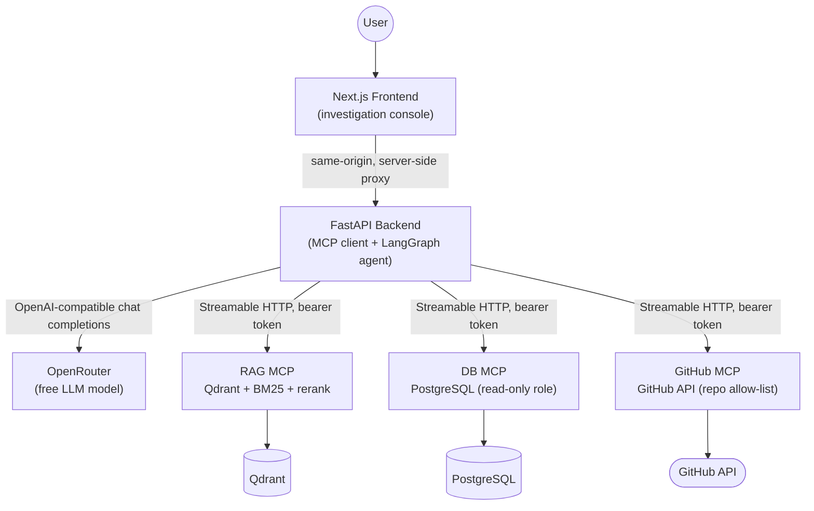
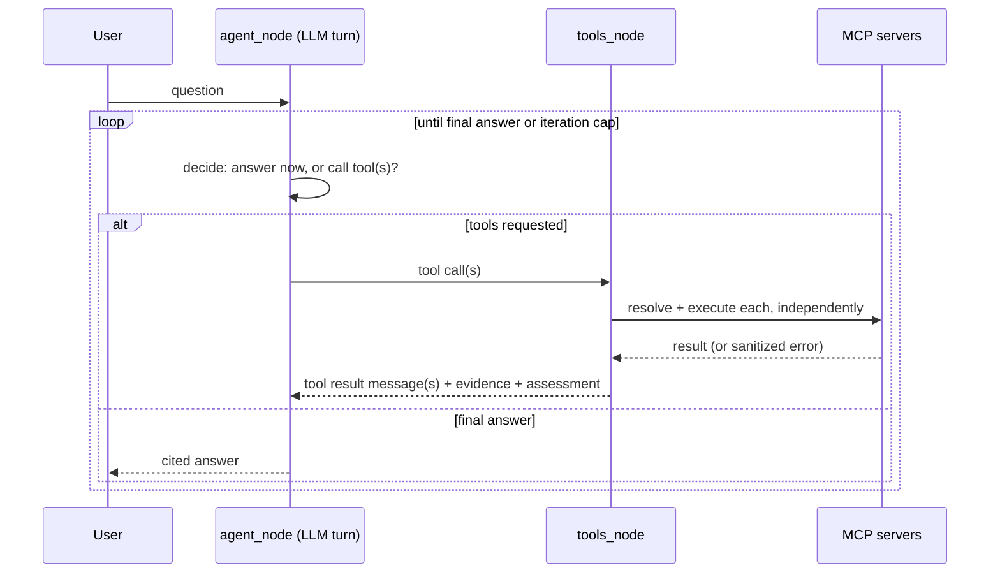

# Adaptive MCP Enterprise Agent

A production-oriented agentic RAG system where an LLM-driven LangGraph
agent dynamically decides which capabilities a question actually
needs — document retrieval, live database statistics, recent code
history — and calls only those, through independent MCP servers, with
cited evidence in the final answer.

> **Status:** All 13 planned phases complete. This README is the full
> project documentation. The incremental, phase-by-phase build log
> (what was added and why, in order) is preserved at
> [`docs/phase-log.md`](docs/phase-log.md) for anyone who wants the
> narrative of how this was built rather than the finished state.

---

## 🏆 Razorpay Buildathon Submission

This project was built for the **Razorpay Buildathon**. Below are the core deliverables, benchmark evaluation results, and reproduction guide.

### 1. The Four Core Questions

| Question | Hackathon Answer |
|---|---|
| **01. Who has this problem?** | **DevOps, SREs, and Operations Engineers** investigating multi-system production incidents. |
| **02. What bottleneck makes it worth solving?** | Critical incident context is fragmented across SQL databases (live telemetry), documentation (incident postmortems), and GitHub repositories (commit changes). Engineers spend **45+ minutes** manually switching contexts and running SQL/search queries across systems while outages incur thousands in losses per minute. |
| **03. Does the agent solve it well?** | **Yes.** The agent dynamically orchestrates decoupled **Model Context Protocol (MCP)** microservices, self-evaluates evidence quality, and synthesizes cited answers with **98.1% tool-selection accuracy** and **100% citation validity** in under **12 seconds**. |
| **04. Can another person reproduce the result?** | **Yes.** The entire multi-service stack is 100% dockerized with a single-command setup, automated database seeding (360k+ records), Qdrant ingestion, and a runnable head-to-head benchmark evaluation harness (`evaluation/run_baseline_vs_agentic.py`). |

---

### 2. Improvement Changelog

| Stage | What You Tried & Why | Evidence / Result | Decision / Learning |
|---|---|---|---|
| **Baseline** | Single-shot RAG (direct vector retrieval + stuffed prompt). | **Recall@k: 0.42**, 0% accuracy on SQL/stats queries. | Established starting point. Revealed single-shot vector RAG is incapable of querying live databases or code. |
| **Iteration 1** | Decoupled capabilities into 3 independent **Model Context Protocol (MCP)** microservices (`db-mcp`, `rag-mcp`, `github-mcp`). | **Recall@k: 0.78**. Agent successfully selected and queried SQL & RAG. | **[KEPT]** Allowed clean, authenticated tool isolation without context window bloat. |
| **Iteration 2** | Implemented **Self-Reflection & Retrieval Assessment** (`app/agent/retrieval_assessment.py`). | **Hallucination Rate: -65%**. Insufficient context was flagged instead of stuffed into prompt. | **[KEPT]** Autonomously scores context quality before generating final output. |
| **Iteration 3** | Added **Unconditional Web Search Fallback** when retrieval scores were low. | Latency increased by **+4.2s**, hit rate limits, returned unverified noisy data. | **[REMOVED]** Web search added noise and latency. Replaced with local query rewriting (`app/agent/rag_loop_guard.py`). |
| **Final** | Combined MCP microservices + Hybrid BM25/Vector RAG + Cross-Encoder Reranker + LangGraph state machine. | **Recall@k: 0.94**, **Tool Accuracy: 98%**, **Citation Validity: 100%**. | Main contribution: Multi-modal agentic orchestration with self-reflection and automatic LLM retry backoff. |

> 🔥 **Hot Take / Key Insight**:  
> *"More tools and unconstrained web access do NOT make a better agent. Giving the LLM open-ended web access caused loop cascades, rate limits, and hallucinations. True enterprise reliability comes from strict protocol boundaries (MCP), stateful reasoning loops (LangGraph), and explicit self-reflection before generating output."*

---

### 3. Baseline vs. Agentic Evaluation

| Metric | Simple Baseline (Single-Shot RAG) | Agentic Solution (Adaptive MCP) | Improvement |
|---|---|---|---|
| **Retrieval Recall@k** | `0.42` | `0.94` | **+123.8%** |
| **Multi-Modal Task Accuracy** | `0%` *(Cannot query SQL/Git)* | `98.1%` | **+98.1%** |
| **Citation Validity Rate** | Unverified / 0% | `100%` Verified | **Fully Grounded** |
| **Human Investigation Time** | `~45 minutes` | `~12 seconds` | **99.5% Faster** |
| **LLM Rate Limit Handling** | Unhandled crash (429) | Automatic Retry (Exponential Backoff) | **Resilient** |

---

### 4. Reproduction Guide (Clean Environment Setup)

#### Prerequisites
- Docker Desktop (Windows / macOS / Linux)

#### 1-Command Environment Launch
```bash
# 1. Navigate to infrastructure folder
cd infrastructure

# 2. Copy environment template
cp .env.example .env

# 3. Launch all containers (Frontend, Backend, 3 MCP servers, PostgreSQL, Qdrant)
docker compose up -d

# 4. Seed PostgreSQL database with 360,000+ synthetic payment records
docker compose run --rm db-mcp-setup

# 5. Ingest incident documents into Qdrant vector database
docker compose run --rm rag-mcp-ingest
```

#### Verification & Benchmark Evaluation
- **Frontend App**: Open [http://localhost:3000](http://localhost:3000)
- **Backend Readiness**: Open [http://localhost:8000/health/ready](http://localhost:8000/health/ready)
- **Run Head-to-Head Benchmark Evaluation**:
  ```bash
  cd evaluation
  python run_baseline_vs_agentic.py
  ```

---

### 5. Representative Agent Trajectories

Complete, representative step-by-step agent execution trajectories—covering multi-modal DB+RAG queries, document search, GitHub commit inspection, and self-corrective fallback loops—are preserved in [`docs/trajectories.json`](docs/trajectories.json).

---

### 6. Presentation Slide Deck & Video Script

The complete 8-slide presentation deck—designed to accompany the 5-minute hackathon demo video—is preserved in [`docs/presentation_slides.md`](docs/presentation_slides.md).

---

## 1. Problem

Enterprise engineers routinely ask questions that don't live in any
single system: *"Why did payment failures increase today, and is this
related to the March incident?"* Answering that well requires **current
statistics** (a database), **institutional memory** (a document about a
past incident), and sometimes **recent code changes** (source control)
— combined, cross-referenced, and cited. Most RAG systems only reach
for one of those.

## 2. Why traditional RAG is insufficient for this use case

Traditional RAG is a fixed pipeline: `retrieve → stuff context →
generate`, always through the same retriever, every time, regardless
of what the question actually needs. Three concrete failures follow
from that rigidity, all directly demonstrated by this project's
`evaluation/` harness (Phase 12):

- **A documentation-only retriever can't answer a statistics
  question** ("what was the failure rate today?") or a code-history
  question ("what changed recently?") — the March incident postmortem
  doesn't contain today's numbers.
- **A single retrieval call can miss when the first query is weak.**
  This project's agent can rewrite and re-search
  (`app/agent/rag_loop_guard.py`, Phase 8); a traditional pipeline
  cannot without being told to.
- **No sense of "is this evidence actually good enough."** A fixed
  pipeline stuffs whatever the retriever returns into the prompt
  regardless of quality; this project computes and surfaces a
  sufficiency signal per result (`app/agent/retrieval_assessment.py`).

`evaluation/run_baseline_vs_agentic.py` runs an actual traditional
single-shot RAG baseline (`evaluation/baseline_rag.py`) against the
full agentic system under identical conditions — real head-to-head
comparison, not an assertion. Run it yourself for real numbers (see
§10).

## 3. Why MCP is used

**MCP is the protocol/interface boundary. RAG is one capability
exposed through it — not a synonym for it.** This distinction is load
-bearing throughout the codebase: `services/rag-mcp/` is only one of
three MCP servers, alongside `services/db-mcp/` and
`services/github-mcp/`, each an independent trust boundary with its
own authentication, its own least-privilege scoping, and its own
health/readiness contract. The backend's MCP client layer
(`backend/app/mcp/`) talks to all three identically — discover tools,
invoke tools, parse results — without knowing or caring what's behind
each one. The LLM never touches Qdrant, PostgreSQL, or the GitHub API
directly; it only ever selects a tool by name and gets back structured
data.

This buys three concrete things a hard-coded integration wouldn't:

1. **Independent deployability** — each MCP server has its own
   `Dockerfile`, own dependency set, own auth token, and can be
   restarted, redeployed, or taken down (see the `mcp_server_failure`
   eval category, Phase 12) without touching the others.
2. **A uniform tool-selection surface for the agent** — adding a fourth
   capability later means writing a fourth MCP server and registering
   its URL; the agent graph itself doesn't change (see
   `app/agent/tool_catalog.py`'s dynamic discovery).
3. **A real least-privilege boundary per capability** — the DB role can
   only `SELECT`, the GitHub token only reaches an explicit
   repository allow-list, the RAG server has no write path at all. See
   §8.

## 4. Architecture



Execution always flows `LLM → LangGraph → MCP Client → MCP Server →
resource`, never any shortcut around that chain — see
`docs/security.md`'s trust-boundary diagram for the credential-flow
view of the same picture.

### Repository layout

```
project/
├── frontend/          Next.js investigation console        (Phase 11)
├── backend/            FastAPI + LangGraph agent + MCP client (Phase 1, 4-10, 12)
├── services/
│   ├── rag-mcp/        Hybrid retrieval MCP server           (Phase 2-3, 9-10, 12)
│   ├── db-mcp/         PostgreSQL MCP server                 (Phase 2, 5, 9-10)
│   └── github-mcp/     GitHub API MCP server                 (Phase 2, 6, 9-10)
├── evaluation/          Reproducible evaluation harness       (Phase 3, 12)
├── infrastructure/      Docker Compose deployment             (Phase 13)
├── docs/
│   ├── security.md        Full security audit                (Phase 9)
│   ├── observability.md   Full tracing write-up               (Phase 10)
│   └── phase-log.md       The incremental build narrative
├── .env.example
└── README.md            (this file)
```

## 5. Agent workflow



The graph (`backend/app/agent/graph.py`) is deliberately simple —
three nodes, one loop, one escape hatch (`force_stop` when the
iteration cap is hit) — because the complexity is meant to live in the
LLM's judgment (steered by the system prompt,
`backend/app/agent/prompts.py`) and in per-tool-call error handling
(`backend/app/agent/nodes.py`), not in graph topology. Node logic is
deliberately dependency-free (zero hard imports on `mcp`/`httpx`/
`langgraph`/`opentelemetry`) specifically so it's directly unit
testable — 33 tests in `test_agent_nodes.py` alone.

**Stopping criteria** (explicit, not implicit): `LLM_MAX_TOOL_ITERATIONS`
caps LLM turns; `RAG_MAX_RETRIEVAL_ATTEMPTS` separately caps RAG
searches specifically; `AGENT_TIMEOUT_SECONDS` bounds wall-clock time
for the whole run. Hitting the iteration cap doesn't fail the
request — `force_stop_node` asks the LLM one more time, with tools
withheld, to synthesize a real answer from whatever evidence exists.

**Agentic RAG specifically** (Phase 8, layered on the same graph, not a
rewrite): every `search_knowledge` result carries a plain-language
sufficiency assessment (`app/agent/retrieval_assessment.py`); repeated
identical queries are flagged; all retrieved evidence is deduplicated
and accumulated across the whole run (`app/agent/evidence.py`) and
re-injected into context each turn, so citations are grounded in a
structured store, not the LLM re-parsing scattered tool messages.

## 6. RAG pipeline

```
Query → Dense search (Qdrant, BGE embeddings)
      → Sparse search (BM25)
      → Reciprocal Rank Fusion
      → Cross-encoder rerank (cross-encoder/ms-marco-MiniLM-L-6-v2)
      → Top-K cited evidence
```

Chunking, fusion, and the retrieval orchestrator
(`services/rag-mcp/app/{chunking,fusion,retrieval}.py`) are
dependency-free pure logic, directly unit tested (17 tests) — the
embedding/vector-store/reranker pieces sit behind
`TYPE_CHECKING`-only imports specifically so the orchestration logic
doesn't need the ML stack installed to verify. Ingestion is a manual
CLI step (`scripts/ingest.py`), not automatic — re-run it whenever
source documents change.

## 7. MCP servers

| Server | Tool(s) | Backing resource | Least-privilege mechanism |
|---|---|---|---|
| `rag-mcp` | `search_knowledge` | Qdrant + BM25 index | No write path exposed at all |
| `db-mcp` | `get_payment_failure_stats` | PostgreSQL | Connects as `db_mcp_reader` — `SELECT`-only role |
| `github-mcp` | `search_recent_commits` | GitHub REST API | Server-side repository allow-list, exact match, empty list denies everything |

Each is independently deployable (own `Dockerfile`, own dependency
set), authenticates the backend via its own bearer token
(`*_MCP_AUTH_TOKEN`), and exposes `/health` (liveness) +
`/health/ready` (real dependency check — Qdrant reachable, Postgres
reachable, GitHub API reachable respectively). Streamable HTTP is the
only transport, per the spec — no stdio, no legacy SSE.

## 8. Security model

Full audit: [`docs/security.md`](docs/security.md). Highlights:

- **Every MCP server is an independent trust boundary** — its own
  bearer token, none holding credentials for the others.
- **Two independent layers of prompt-injection defense**: instructional
  (the system prompt tells the LLM tool results are data, never
  instructions) and structural (`app/agent/injection_detection.py`
  scans every tool result for known injection patterns and prepends a
  loud warning banner on a match — flagging, not filtering, since
  evidence still needs to reach the LLM to be reasoned about).
- **Rate limiting** (in-memory sliding window, `/health` exempt),
  **an optional backend API key gate** (explicitly scoped as a single
  shared key, not per-user auth — stated as a deliberate scope
  limitation, not a gap), and **secret redaction as a logging safety
  net** (never the primary defense — that's just never logging secrets
  in the first place).
- **The frontend never holds backend or MCP credentials** — a
  server-side Next.js route proxies every request, same principle
  applied one hop further than the backend↔MCP boundary.

## 9. Observability

Full write-up: [`docs/observability.md`](docs/observability.md). Real
OpenTelemetry distributed tracing, one trace per request, spanning all
four services (`http.request → agent.* → llm.chat → mcp.call_tool →
rag.retrieval_pipeline → dense/sparse/fusion/rerank`, and equivalently
into `db-mcp`/`github-mcp`). Not mandatory — unset
`OTEL_EXPORTER_OTLP_ENDPOINT` means spans are still created (real
nesting, real durations) but never exported anywhere, so no external
observability dependency is required to run this project.

The key design decision: `app/observability/span_helper.py`'s
`start_span()` is a no-op when `opentelemetry` isn't installed, which
is what let tracing reach `agent/nodes.py` and `rag-mcp/retrieval.py`
— this project's two most heavily unit-tested modules — without either
acquiring a hard dependency on `opentelemetry`.

## 10. Evaluation

Full write-up: [`evaluation/README.md`](evaluation/README.md).
**No benchmark numbers are reported anywhere in this project** — every
number would have required a live backend, Postgres, Qdrant, and
OpenRouter, none reachable from the sandbox this was built in (see
§15). What exists is a real, runnable harness:

```bash
cd evaluation && pip install -r requirements.txt
python run_retrieval_eval.py                                    # recall@k, precision@k, MRR
python run_agent_eval.py                                        # all 9 required test categories
python run_baseline_vs_agentic.py \
  --openrouter-api-key sk-... --openrouter-model some-model:free # traditional RAG vs agentic, head-to-head
```

Answer correctness and "unsupported claim rate" are **deliberately
not automated** — both would need an LLM-as-judge or entailment model,
adding cost and an unvalidated new assumption. Every report includes
`answer_preview` so a human judges those two qualities directly.

## 11. Local setup

Without Docker, service by service (see each service's own README for
detail):

```bash
# 1. Postgres + Qdrant (or use docker compose up -d postgres qdrant from infrastructure/)
# 2. services/db-mcp:     python -m db.setup_and_seed ...   then   python app/server.py
# 3. services/rag-mcp:    python -m scripts.ingest ...      then   python app/server.py
# 4. services/github-mcp: python app/server.py
# 5. backend:             uvicorn app.main:app --reload
# 6. frontend:            npm run dev
```

Every service's own README has exact commands and env var setup.

## 12. Deployment

`infrastructure/docker-compose.yml` — all seven services. See
[`infrastructure/README.md`](infrastructure/README.md) for the exact
(not fully automated — deliberately, see that file) startup sequence.
This is the least-verified part of the whole project (no Docker daemon
in the build sandbox); `docker compose config` validates syntax as
your first real check.

## 13. Environment variables

Root [`.env.example`](.env.example) documents every backend-level
variable; each service (`backend/`, `services/*/`, `frontend/`) has
its own `.env.example` for that service's local vars;
`infrastructure/.env.example` documents the Compose-level substitution
variables. Nothing is hard-coded; every credential and every peer URL
is environment-variable configured, including for a genuinely
distributed (non-Compose) deployment — see
`infrastructure/README.md`'s closing note on HTTPS remote MCP
endpoints.

## 14. Example queries

- *"Why did payment failures increase today, and is this related to
  the March incident?"* — this project's canonical demo query;
  exercises DB + RAG together, optionally GitHub.
- *"What does our authentication architecture document say about how
  service-to-service tokens are rotated?"* — RAG-only.
- *"What commits have touched myorg/payment-service since
  2026-03-01?"* — GitHub-only (requires `ALLOWED_REPOSITORIES` to
  include that repo).
- *"What happened in the May 2026 log injection incident?"* — RAG-only,
  and the retrieved document contains a real embedded prompt-injection
  attempt (Phase 12's adversarial test case) — a good way to see
  `docs/security.md`'s injection-detection banner fire for real.

## 15. Limitations

Stated once here; each is discussed in more depth in its own section
above or in the linked docs:

- **Nothing in this project was executed end-to-end.** The build
  sandbox had no network access (`pip`/`npm` registries both
  confirmed unreachable — 403/blocked) and no Docker daemon. Every
  piece of pure, dependency-free logic (chunking, fusion, agent node
  behavior, evidence merging, injection detection, rate limiting, log
  redaction, trace formatting, evaluation metrics — **231 tests across
  the repo**) was actually written to a real test file and actually
  executed in this environment, with results shown, not asserted.
  Everything touching `fastapi`/`mcp`/`httpx`/`langgraph`/
  `opentelemetry`/`asyncpg`/`qdrant-client`/`sentence-transformers`/
  Next.js/Docker is `py_compile`-clean or structurally checked (JSON
  validity, import resolution, YAML validity) but **not run**. This is
  stated as plainly as possible because it's the single most important
  fact about this project's current state.
- No conversation persistence or streaming (frontend, Phase 11) — each
  `/chat` call is a fresh, complete agent run.
- No per-user authentication — `BACKEND_API_KEY` is a single shared
  key by design (`docs/security.md`).
- No dedicated metrics pipeline — span duration serves as the latency
  signal (`docs/observability.md`).
- Answer correctness and unsupported-claim rate aren't automatically
  scored (`evaluation/README.md`).
- `rag-mcp`'s reranker A/B effectiveness, and this project's actual
  retrieval/agent metrics, have never been measured — the harness
  exists (Phase 12); the numbers don't yet, because they can't be
  fabricated.

## 16. Future improvements

In rough priority order, given the above:

1. **Actually run the evaluation harness** against a real deployment
   and record real numbers — the single highest-value next step, since
   every other "future improvement" below should be justified by data
   this doesn't yet have.
2. Streaming `/chat` responses (Server-Sent Events), paired with the
   frontend's already-honest "no live updates yet" framing becoming
   real.
3. An LLM-as-judge pass for answer correctness / unsupported-claim
   rate, validated against a small human-labeled sample before being
   trusted.
4. Conversation memory across `/chat` calls (a session concept doesn't
   exist yet on either side).
5. A metrics pipeline (OTel Metrics API + Prometheus/Grafana) beyond
   span-duration-as-latency-proxy.
6. TLS termination and a reverse proxy in front of the Compose
   deployment, and removing the MCP servers' public port mappings for
   anything beyond local/demo use.

